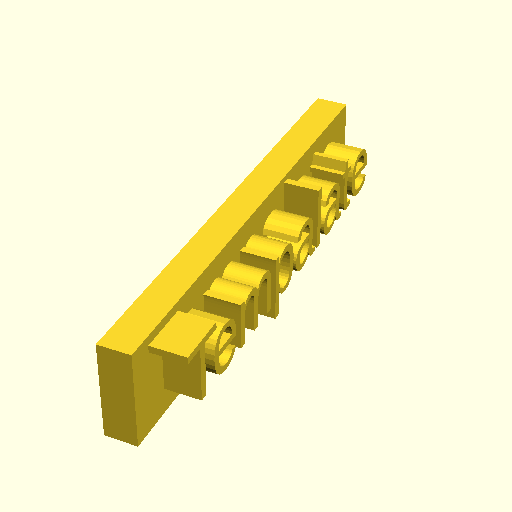

# OpenScadTemplateProject

This is a template project, using the [OpenScadTemplateUtils](https://github.com/Roel1983/OpenScadUtils.git) as submodule.


## cloning the repository
```
git clone --recurse-submodules https://github.com/Roel1983/OpenScadTemplateProject.git
cd bar
```

For already cloned repos, or older Git versions, use:
```
git clone https://github.com/Roel1983/OpenScadTemplateProject.git
cd OpenScadTemplateProject
git submodule update --init --recursive
```
